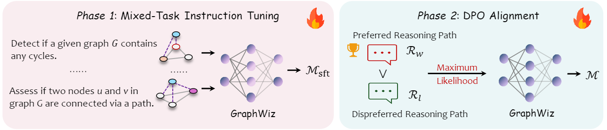
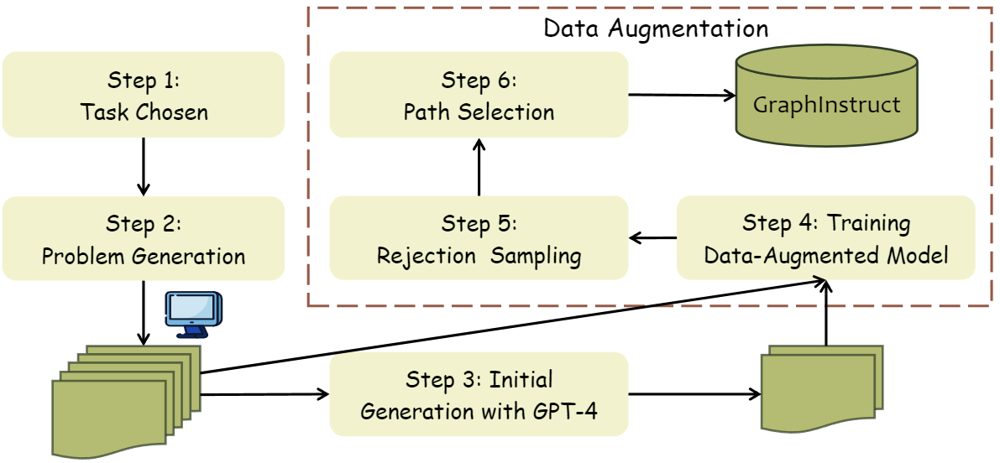

# GraphWiz (Graph-Reasoning-LLM)

This repo contains the code, data, and models for "[**GraphWiz: An Instruction-Following Language Model for Graph Problems**](https://arxiv.org/abs/2402.16029)."


<div align="center">
 🔥 🔥 🔥 Check out our <a href = "https://graph-wiz.github.io/">[Project Page]</a> for more results and analysis! 🔥 🔥 🔥
</div>


<br>
<div align="center">
  
</div>


<div style="text-align: center;"><strong>This  project aims at leveraging instruction-tuning to build a powerful instruction-following LLM that can map textural descriptions of graphs and structures, and then solve different graph problems explicitly in natural language.</strong></div>
To accomplish this, we make the following works:

- **GraphWiz**, a series of instruction-following LLMs that have strong  graph problem-solving abilities and output explicit reasoning paths.
- **GraphInstruct**, which offers over 72.5k training samples across nine graph problem
tasks, ranging in complexity from linear and polynomial to NP-complete, extending the scope, scale,
and diversity of previous benchmarks.


#### News

- This paper is accepted by KDD 2024! 🎉🎉🎉


## Results

| *Models* | **Cycle** | **Connect** | **Bipartite** | **Topology** | **Shortest** | **Triangle** | **Flow** | **Hamilton** | **Subgraph** | **Average** |
|:-------------------------------------:|:-------------------------------:|:--------------------------------:|:----------------------------------:|:---------------------------------:|:---------------------------------:|:---------------------------------:|:-----------------------------:|:---------------------------------:|:---------------------------------:|:--------------------------------------:|
| *In-Context Learning* |||||||||||
| **GPT-4 (zero-shot)**                 | 38.75                           | 17.00                            | 65.25                              | 5.00                              | 9.25                              | 5.75                              | 3.25                          | 59.25                             | 45.50                             | 27.67                                  |
| **GhatGPT (2-shot)**                  | 51.25                           | 43.75                            | 70.75                              | 4.50                              | 3.50                              | 17.25                             | 8.50                          | 54.25                             | 43.00                             | 32.97                                  |
| **GPT-4 (2-shot)**                    | 52.50                           | 62.75                            | 74.25                              | 25.25                             | 18.25                             | 31.00                             | 7.75                          | {75.75}                    | 46.75                             | 43.81                                  |
| *Mistral-7B* |||||||||||
| **Naive SFT**                         | 73.75                           | 83.50                            | 78.50                              | 1.00                              | 23.00                             | 47.00                             | 28.75                         | 31.75                             | 41.25                             | 46.56                                  |
| **GraphWiz**                        | **92.00**                  | **89.50**                     | 72.00                              | 19.00                             | **31.25**                      | 38.75                             | 29.25                         | 26.50                             | **85.50**                      | 53.75                                  |
| **GraphWiz-DPO**                    | 85.50                           | 79.50                            | **85.50**                     | **85.25**                      | 12.50                             | 29.00                             | 35.50                         | 62.75                             | 48.50                             | 58.22                                  |
| *LLaMA 2-7B* |||||||||||
| **Naive SFT**                         | 73.75                           | 83.50                            | 41.25                              | 4.00                              | 9.50                              | 30.00                             | 16.50                         | 69.00                             | 75.45                             | 44.81                                  |
| **GraphWiz**                        | 91.50                           | 87.00                            | 74.00                              | 18.00                             | **28.00**                    | 38.25                             | 24.50                         | 52.25                             | **82.25**                    | 55.08                                  |
| **GraphWiz-DPO**                    | 89.00                           | 82.50                            | 84.75                              | 46.75                             | 24.00                             | **52.75**                      | **43.50**                | **81.50**                      | 77.25                             | **65.00**                           |
| *LLaMA 2-13B* |||||||||||
| **Naive SFT**                         | 73.75                           | 83.75                            | 59.00                              | 0.50                              | 11.75                             | 34.75                             | 24.25                         | 59.75                             | 54.75                             | 44.69                                  |
| **GraphWiz**                        | **94.75**                    | 87.00                            | 78.00                              | 28.00                             | 27.75                             | 36.00                             | 24.50                         | 59.00                             | 81.50                             | 57.39                                  |
| **GraphWiz-DPO**                    | 87.50                           | **88.50**                   | **88.25**                       | **72.75**                    | 22.00                             | **48.75**                    | **43.75**                  | 46.50                             | 77.00                             | **63.89**                         |


## Usage & Download

Our checkpoints and dataset are available at HuggingFace. You can directly download them according to the following links:

### 🤗Models🤗


| GraphWiz   	| Mixed-Task Training                                       	| DPO                                                       	|
|-----	|---------------------------------------------------------------	|---------------------------------------------------------------------------	|
| 🤗**7B-LLaMA 2**  	| 🪄 [**GraphWiz-7B**](https://huggingface.co/GraphWiz/LLaMA2-7B), [**GraphWiz-7B-RFT**](https://huggingface.co/GraphWiz/LLaMA2-7B-RFT)    	| 🪄 [**GraphWiz-7B-DPO**](https://huggingface.co/GraphWiz/LLaMA2-7B-DPO)  	|
| 🤗**13B-LLaMA 2** 	| 🪄 [**GraphWiz-13B**](https://huggingface.co/GraphWiz/LLaMA2-13B), [**GraphWiz-13B-RFT**](https://huggingface.co/GraphWiz/LLaMA2-13B-RFT)	| 🪄 [**GraphWiz-13B-DPO**](https://huggingface.co/GraphWiz/LLaMA2-13B-DPO)	|
| 🤗**7B-Mistral** 	| 🪄[**GrpahWiz-7B**](https://huggingface.co/GraphWiz/Mistral-7B), [**GrpahWiz-7B-RFT**](https://huggingface.co/GraphWiz/Mistral-7B-RFT)   	| 🪄 [GraphWiz-7B-DPO] 	|


### 🤗Dataset🤗

 🤗[**GraphInstruct**](https://huggingface.co/datasets/GraphWiz/GraphInstruct), 
 
 🤗[**GraphInstruct-RFT**](https://huggingface.co/datasets/GraphWiz/GraphInstruct-RFT-72K)  

 🤗[**GraphInstruct-DPO**](https://huggingface.co/datasets/GraphWiz/GraphInstruct-DPO)  

 🤗[**GraphInstruct-Test**](https://huggingface.co/datasets/GraphWiz/GraphInstruct-Test)  


*-vanilla version means to our model only trained with Q:R=1:1

*-RFT refers to our model trained with all Q-R paths


## **Table of Contents**

- [ℹ QuickStart](#quick-start)
- [🛠️ Training and Inference](#training-graphwiz)
- [📜 Data Generation](#graphinstruct-construction)
- [📖 Citation](#citation)


### Quick Start


```
# Use a pipeline as a high-level helper
from transformers import pipeline

pipe = pipeline("text-generation", model="GraphWiz/Mistral-7B")
alpaca_template = "Below is an instruction that describes a task. Write a response that appropriately completes the request. \n### Instruction:\n{query}\n\n### Response:"

query = "Find the shortest path between two nodes in an undirected graph. In an undirected graph, (i,j,k) means that node i and node j are connected with an undirected edge with weight k. Given a graph and a pair of nodes, you need to output the shortest path between the two nodes. Q: The nodes are numbered from 0 to 8, and the edges are: (0,1,4) (1,2,7) (1,7,1) (1,3,4) (2,6,2) (2,4,8) (2,7,5) (3,6,1) (4,8,3) (5,6,6) (6,8,8) (7,8,7). Give the weight of the shortest path from node 0 to node 8."


input = alpaca_template.format(query = query)

output = pipeline(input)[0]['generated_text']
print(output)
```
## Training GraphWiz 


Our training strategies include two stage: **Mixed-task Training** and **DPO Alignment**.

<br>
<div align="center">
  
</div>


Before we start, we need to transfer our data into the [deepspeed](https://github.com/microsoft/DeepSpeedExamples/tree/master/applications/DeepSpeed-Chat/training/step1_supervised_finetuning) training format.

You can see examples in our **dataset/GraphInstruct-DPO-ds.json** file.


### Requirements

```
pip -r install requirements.txt
```

### Phase1: Mixed-Task Training 

```
cd training/step1_supervised_finetuning
bash training_scripts/single_node/run_graph.sh
```

which consists of the following commands:

```

#!/bin/bash
# Copyright (c) Microsoft Corporation.
# SPDX-License-Identifier: Apache-2.0
# DeepSpeed Team
OUTPUT=$1
ZERO_STAGE=$2
DATA_PATH=$3
MODEL_PATH=$4
if [ "$OUTPUT" == "" ]; then
    OUTPUT=/output/deepspeed/nlgreasoning/
fi
if [ "$ZERO_STAGE" == "" ]; then
    ZERO_STAGE=3
fi 
mkdir -p $OUTPUT

deepspeed --include localhost:0,1,2,3 --master_port=25001 main.py  \
   --data_path local/jsonfile_graph/$DATA_PATH \
   --data_split 10,0,0 \
   --model_name_or_path $MODEL_PATH \
   --per_device_train_batch_size 4 \
   --per_device_eval_batch_size 2 \
   --max_seq_len 2048 \
   --learning_rate 5e-6  \
   --weight_decay 0. \
   --num_train_epochs 2  \
   --gradient_accumulation_steps 2 \
   --lr_scheduler_type cosine \
   --num_warmup_steps 500 \
   --seed 1234 \
   --save_interval 5000 \
   --zero_stage $ZERO_STAGE \
   --deepspeed \
   --data_output_path $OUTPUT \
   --gradient_checkpointing \
   --output_dir $OUTPUT \
   &> $OUTPUT/training.log &

```


### Phase2: DPO Training 


```bash
cd training/step2_dpo_training
bash training_scripts/single_node/run_graph.sh
```

which consists of the following commands:

```

#!/bin/bash
# Copyright (c) Microsoft Corporation.
# SPDX-License-Identifier: Apache-2.0
# local/xjsonfile/rftV2
# DeepSpeed Team
OUTPUT=$1
ZERO_STAGE=$2
DPO_PATH=$3
SFT_PATH=$4
if [ "$OUTPUT" == "" ]; then
    OUTPUT=output/deepspeed/nlgreasoning/dpo_beta0.5/
fi
if [ "$ZERO_STAGE" == "" ]; then
    ZERO_STAGE=3
fi
mkdir -p $OUTPUT

deepspeed --include localhost:0,1,2,3,4,5,6,7 --master_port=25001 main.py  \
   --data_path local/jsonfile_graph/$DPO_PATH \
   --data_split 0,10,0 \
   --model_name_or_path $SFT_PATH \
   --per_device_train_batch_size 2 \
   --per_device_eval_batch_size 2 \
   --max_seq_len 2048 \
   --learning_rate 5e-6  \
   --weight_decay 0. \
   --num_train_epochs 3  \
   --gradient_accumulation_steps 2 \
   --lr_scheduler_type cosine \
   --num_warmup_steps 100 \
   --seed 1234 \
   --beta 0.5 \
    --print_loss \
   --zero_stage $ZERO_STAGE \
   --deepspeed \
   --data_output_path $OUTPUT \
   --gradient_checkpointing \
   --output_dir $OUTPUT \
   &> $OUTPUT/training.log &

```


### Inference & Test

```
cd evaluation
bash test_graph.sh
```


## GraphInstruct Construction


<br>
<div align="center">
  
</div>


If you want to construct additional graph problem data for training your own models for graph problem reasoning. Please refer to the following:

### Generate Graph Problems

#### step1: Generate all train set

```
cd scripts
bash generate_all_train_datasets.sh
```

#### Generate all test set

```
cd scripts
bash generate_all_test_datasets.sh
```

### Step2: Data Augmentation with Rejection Sampling
Here, we introduce how to select diverse paths for dpo training data:

#### Step2.1: Inference SFT model multiple times
 Suppose we already have the sft model. You can directly use our models at HuggingFace: [**GraphWiz**](https://huggingface.co/GraphWiz)
```
cd evaluation
bash rft.sh
```
The default inference times 'seed' is set to 20.

#### Step2.2: Select the diverse paths 

Then we filter out the diverse reasoning paths:

```
cd find_paths
python3 select_path_dpo.py

python3 find_path.py
```

Please note that you should changle the data paths according to your local enviroment.

At last, you can obtain the json file like:

```
 "0": {
        "neg_response": [
            "To find the maximum flow from node 4 to node 8, we need to consider all the possible paths from node 4 to node 7, and then from node 7 to node 8. \nOne such path is 4->5->7->8, which can carry a flow of 6 units, as limited by the edge (4->5).\nAnother path is 4->6->7->8, which can carry a flow of 7 units, as limited by the edge (4->6).\nHowever, not all of this flow can reach node 8, because the edge (7->8) has a capacity of 3 units, and the edge (6->8) has a capacity of 10 units. Therefore, the bottleneck of this path is the edge (7->8), which reduces the flow to 3 units.\nTherefore, by adding the flows of the two paths, we get the maximum flow from node 4 to node 8 as 6 + 7 = 13 units.\n### The maximum flow from node 4 to node 8 is 13 units.",
            "The maximum flow from node 4 to node 8 is equal to the sum of the flows on the edges leaving node 4, which is 7 + 6 = 13 units. ### 13.",
            "To find the maximum flow from node 4 to node 8, we need to consider all possible paths from node 4 to node 8 and their capacities. One such path is 4->5->7->8, which has a capacity of 6 units, as limited by the edge (4->5). Another path is 4->6->8, which has a capacity of 7 units, as limited by the edge (4->6). However, note that the edge (6->8) has a smaller capacity of 10 units, so it cannot carry all the flow from node 4 to node 8 via this path. Therefore, we need to hybridize the two paths and find a way to allocate the flow between them without compromising the edge capacities. One possible allocation is to send 6 units from node 4 to node 5, 3 units from node 5 to node 7, and 7 units from node 4 to node 6, which gives a total flow of 6 + 3 + 7 = 16 units. However, this allocation is not optimal, as it wastefully converts 6 units of flow from node 4 to node 5, which is then unnecessarily routed to node 7. A more optimal allocation is to send 3 units from node 4 to node 5, 6 units from node 5 to node 7, and 7 units from node 4 to node 6, which gives a total flow of 3 + 6 + 7 = 16 units. This allocation avoids the conversion of any flow from node 4 to node 5, which is then routed to node 7. Hence, the maximum flow from node 4 to node 8 is 16 units, which is the sum of the flows along the two paths.### 16.",
            "### The maximum flow from node 4 to node 8 is 13 units."
        ],
        "pos_response": [
            "To find the maximum flow from node 4 to node 8, we need to consider all possible paths from node 4 to node 8 and their capacities. \nOne such path is through node 5, where node 4 can send up to 6 units to node 5, but node 5 can only forward up to 10 units to node 7, and node 7 can only send up to 3 units to node 8. This path can carry a maximum of 3 units of flow. \nAnother path is through node 6, where node 4 can send up to 7 units to node 6, and node 6 can forward up to 10 units to node 8. This path can carry a maximum of 7 units of flow. \nHowever, note that the capacity of the edge from node 6 to node 8 is 10 units, so it cannot carry more flow than that regardless of the incoming flow from node 4. \nTherefore, by adding the flows along the two paths, we find that the maximum flow from node 4 to node 8 is 10 units. ### 10.",
            "The relevant edges for the flow from node 4 to node 8 are (4->5,6), (4->6,7), (5->7,10), and (6->8,10).\nOne possible path is from node 4 to node 5 and then from node 5 to node 7, and then from node 7 to node 8. This path can carry a flow of 10 units, as limited by the edge (5->7).\nAnother possible path is from node 4 to node 6 and then from node 6 to node 8. This path can carry a flow of 7 units, as limited by the edge (6->8).\nHowever, these two paths share the edge (6->8), which has a capacity of 10 units. Therefore, the total flow that can be sent from node 4 to node 8 cannot exceed 10 units, regardless of the mixture of paths.\nHence, the maximum flow from node 4 to node 8 is 10 units. ### 10."
        ],
        "task": "flow",
        "CoT_response": "To find the maximum flow from node 4 to node 8, we need to consider all possible paths from node 4 to node 8 and their capacities. \nOne such path is through node 5, where node 4 can send up to 6 units to node 5, but node 5 can only forward up to 10 units to node 7, and node 7 can only send up to 3 units to node 8. This path can carry a maximum of 3 units of flow. \nAnother path is through node 6, where node 4 can send up to 7 units to node 6, and node 6 can forward up to 10 units to node 8. This path can carry a maximum of 7 units of flow. \nHowever, note that the capacity of the edge from node 6 to node 8 is 10 units, so it cannot carry more flow than that regardless of the incoming flow from node 4. \nTherefore, by adding the flows along the two paths, we find that the maximum flow from node 4 to node 8 is 10 units. ### 10.",
        "pos_sort": {
            "edit": [
                0,
                1
            ],
            "jaccard": [
                0,
                1
            ],
            "tfidf": [
                0,
                1
            ],
            "cosine": [
                0,
                1
            ]
        **,
        "neg_sort": {
            "edit": [
                0,
                1,
                3,
                2
            ],
            "jaccard": [
                0,
                2,
                1,
                3
            ],
            "tfidf": [
                2,
                0,
                1,
                3
            ],
            "cosine": [
                0,
                2,
                1,
                3
            ]
        },
        "pos_rft_paths_5": [
            "The relevant edges for the flow from node 4 to node 8 are (4->5,6), (4->6,7), (5->7,10), and (6->8,10).\nOne possible path is from node 4 to node 5 and then from node 5 to node 7, and then from node 7 to node 8. This path can carry a flow of 10 units, as limited by the edge (5->7).\nAnother possible path is from node 4 to node 6 and then from node 6 to node 8. This path can carry a flow of 7 units, as limited by the edge (6->8).\nHowever, these two paths share the edge (6->8), which has a capacity of 10 units. Therefore, the total flow that can be sent from node 4 to node 8 cannot exceed 10 units, regardless of the mixture of paths.\nHence, the maximum flow from node 4 to node 8 is 10 units. ### 10."
        ],
        "neg_rft_paths_5": [
            "To find the maximum flow from node 4 to node 8, we need to consider all the possible paths from node 4 to node 7, and then from node 7 to node 8. \nOne such path is 4->5->7->8, which can carry a flow of 6 units, as limited by the edge (4->5).\nAnother path is 4->6->7->8, which can carry a flow of 7 units, as limited by the edge (4->6).\nHowever, not all of this flow can reach node 8, because the edge (7->8) has a capacity of 3 units, and the edge (6->8) has a capacity of 10 units. Therefore, the bottleneck of this path is the edge (7->8), which reduces the flow to 3 units.\nTherefore, by adding the flows of the two paths, we get the maximum flow from node 4 to node 8 as 6 + 7 = 13 units.\n### The maximum flow from node 4 to node 8 is 13 units.",
            "To find the maximum flow from node 4 to node 8, we need to consider all possible paths from node 4 to node 8 and their capacities. One such path is 4->5->7->8, which has a capacity of 6 units, as limited by the edge (4->5). Another path is 4->6->8, which has a capacity of 7 units, as limited by the edge (4->6). However, note that the edge (6->8) has a smaller capacity of 10 units, so it cannot carry all the flow from node 4 to node 8 via this path. Therefore, we need to hybridize the two paths and find a way to allocate the flow between them without compromising the edge capacities. One possible allocation is to send 6 units from node 4 to node 5, 3 units from node 5 to node 7, and 7 units from node 4 to node 6, which gives a total flow of 6 + 3 + 7 = 16 units. However, this allocation is not optimal, as it wastefully converts 6 units of flow from node 4 to node 5, which is then unnecessarily routed to node 7. A more optimal allocation is to send 3 units from node 4 to node 5, 6 units from node 5 to node 7, and 7 units from node 4 to node 6, which gives a total flow of 3 + 6 + 7 = 16 units. This allocation avoids the conversion of any flow from node 4 to node 5, which is then routed to node 7. Hence, the maximum flow from node 4 to node 8 is 16 units, which is the sum of the flows along the two paths.### 16."
        ],
        "query": "Find the maximum flow between two nodes in a directed graph. In a directed graph, (i->j,k) means that node i and node j are connected with an directed edge from node i to node j with weight k. Given a graph and a pair of nodes, you need to output the maximum flow between the two nodes. Q: The nodes are numbered from 0 to 8, and the edges are: (0->7,2) (0->3,9) (1->3,2) (2->3,2) (2->5,4) (4->5,6) (4->6,7) (5->7,10) (6->8,10) (6->7,9) (7->8,3). What is the maximum flow from node 4 to node 8?"
    }

```
- "**pos_rft_paths_5**" refers to the diverse ***Correct*** reasoning paths (<=5);
- "**neg_rft_paths_5**" refers to the diverse ***InCorrect*** reasoning paths (<=5).


## **Citation**

Please cite our paper if you use our data, model or code. Please also kindly cite the original dataset papers. 
```
@articles{chen2024graphwiz,
  title={GraphWiz: An Instruction-Following Language Model for Graph Problems},
  author={Nuo Chen, Yuhan Li, Jianheng Tang, Jia Li},
  journal={arXiv preprint arXiv:2402.16029},
  year={2024}
}
```
